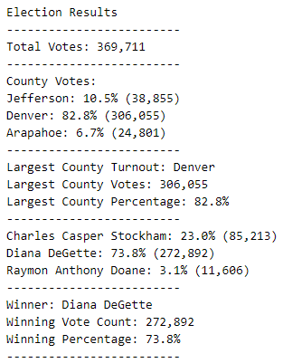

# Election-Analysis

## Challenge Overview
A Colorado Board of Elections employee has given you the following tasks to complete the election audit of a recent local congressional election. 

Prior analysis received the following data:
1. Total number of votes cast. 
2. Complete list of candidates who received votes.
3. Total number of votes each candidate received. 
4. Percentage of votes each candidate won. 
5. Determine the winner of the election based on popular vote. 

For this challenge, the election audit also needed the results from the congressional district election at a county level:
1. The voter turnout for each county.
2. The percentage of votes from each county out of the total count.
3. The county with the highest turnout.

## Resources
- Data Source: election_results.csv
- Software: Python 3.6.1, Visual Studio Code, 1.38.1

## Election-Analysis Results
The analysis of the election show that:
- There were 369,711 votes cast in the election.
- The candidates were:
  - Charles Casper Stockham
  - Diana DeGette
  - Raymon Anthony Doane
- The county results were:
  - Jefferson county received 10.5% of the vote and 38,855 number of votes.
  - Denver county received 82.8% of the vote and 306,055 number of votes.
  - Arapahoe county received 6.7% of the vote and 24,801 number of votes.
- The county with the largest turnout was:
  - Denver county, who received 82.8% of the vote and 306,055 number of votes.
- The candidate results were:
  - Charles Casper Stockham received 23.0% of the vote and 85,213 number of votes.
  - Diana DeGette received 73.8% of the vote and 272,892 number of votes.
  - Raymon Anthony Doane received 3.1% of the vote and 11,606 number of votes.
- The winner of the election was:
  - Diana DeGette, who received 73.8% of the vote and 272,892 number of votes

## Challenge Summary

Overall, this script was able to efficiently combine all of the election results, output the winner of the election and provide us a detailed analysis on the total percentage of votes, as well as the location of where the votes from. Versus having to do the analysis manually. In the future this code is easily able to be reused for any other election analysis needs. Step 1 to utilizing this code for another campaign would be formatting the data in the csv document to have the headers/column match up (county in the second column and candidate in the third column). While we only had three candidates and 3 counties to analyze in this election, we have the ability to analyze more if that is within the new data set.    

Additionally, if they wanted to look at something other than counties, we can adjust the script to have the text/code match the new subject matter. For example, if we were looking at an election for a new superintendent, when voting we could ask which school the voter came from. Then when running the script, we could change all lines that have the word "county" in it to "school". Overall, the script has the capability to expand and change with the needs of potential upcoming campaigns, making it the perfect tool to utilize in upcoming elections.
